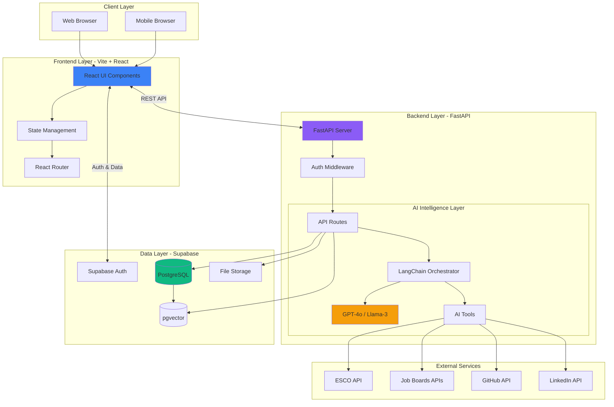
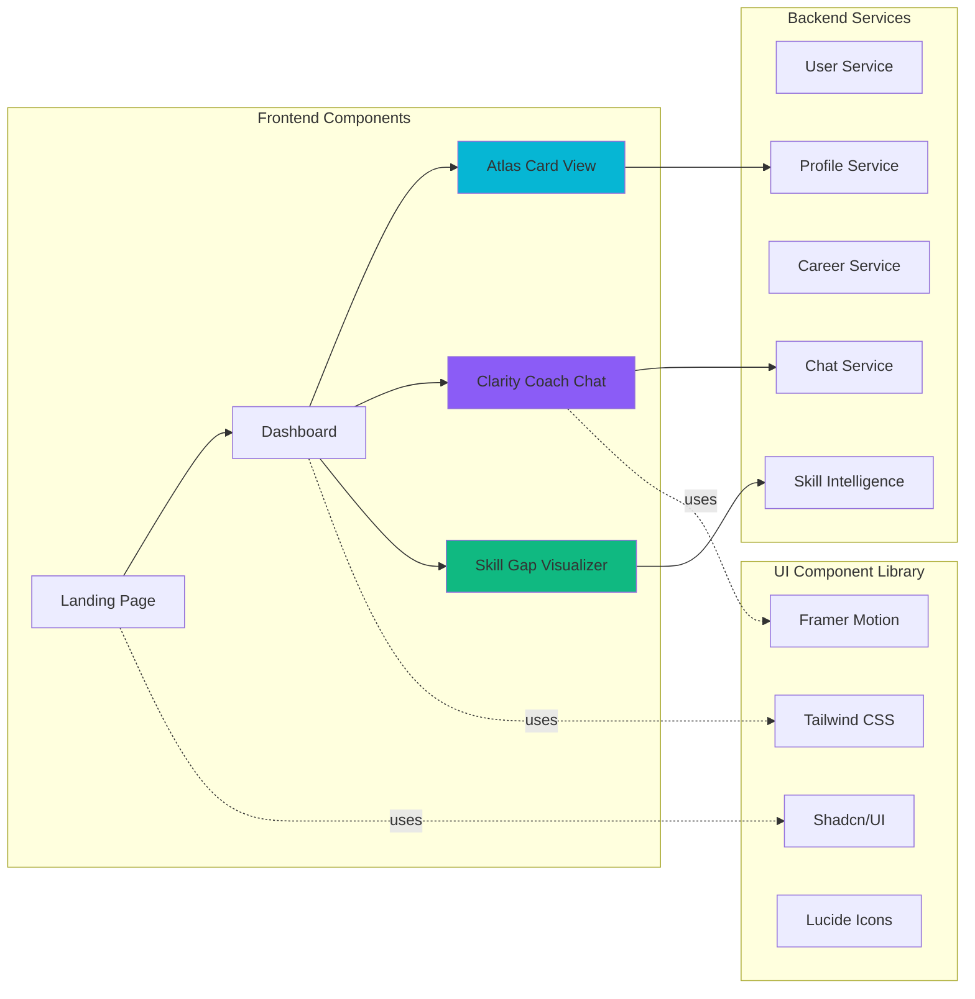
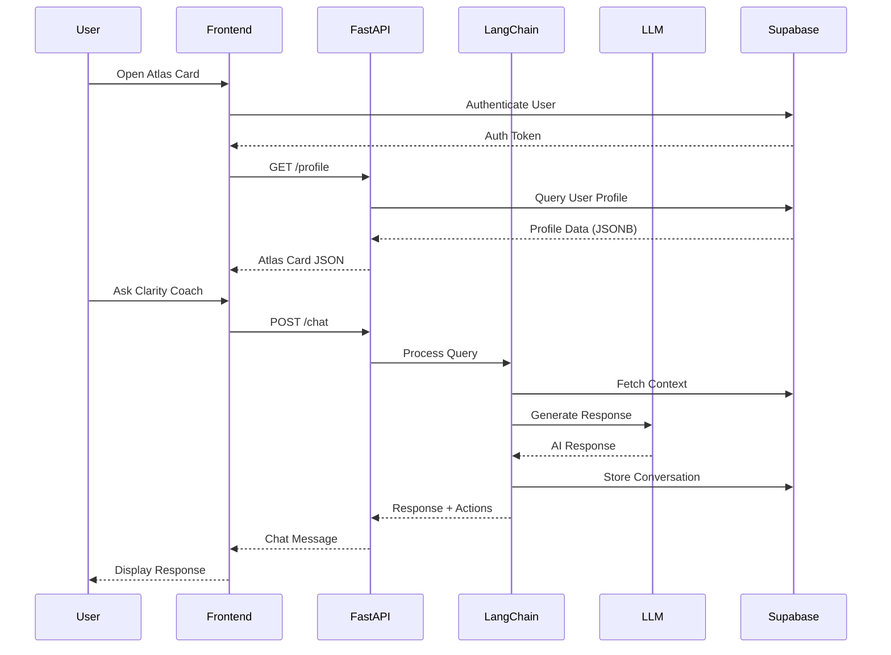
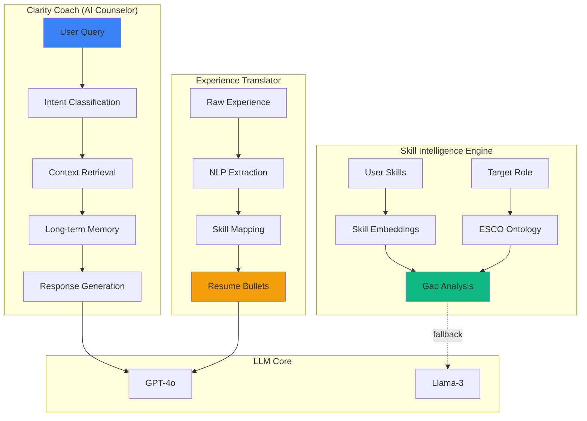
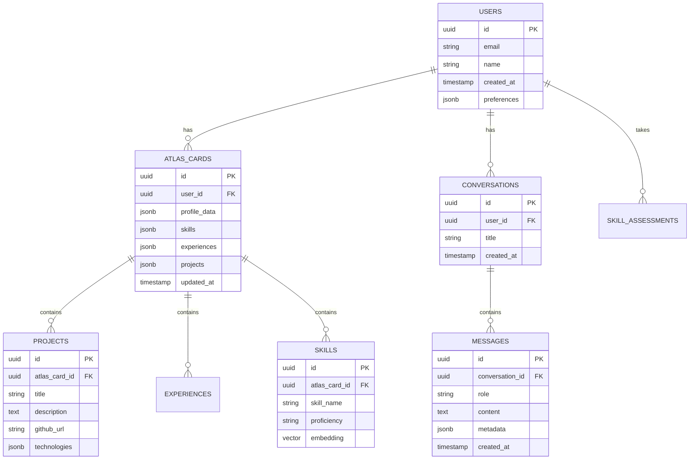
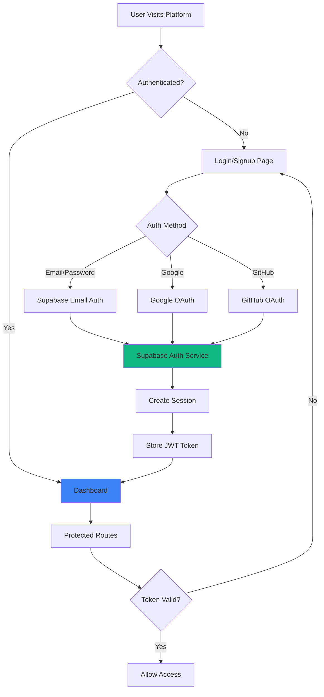
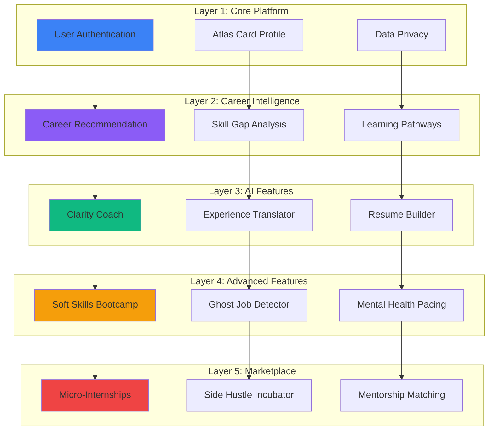

# Atlas AI - System Architecture Diagrams

## 1. High-Level System Architecture



## 2. Detailed Component Architecture



## 3. Data Flow Architecture



## 4. AI Intelligence Layer



## 5. Database Schema (Supabase PostgreSQL)



## 6. Authentication Flow



## 7. Deployment Architecture

```mermaid
graph TB
    subgraph "Production Environment"
        subgraph "Frontend Hosting"
            Vercel[Vercel / Netlify]
            CDN[Global CDN]
            
            Vercel --> CDN
        end
        
        subgraph "Backend Hosting"
            Railway[Railway / Render]
            FastAPIApp[FastAPI Container]
            
            Railway --> FastAPIApp
        end
        
        subgraph "Database & Auth"
            SupabaseProd[Supabase Cloud]
            PostgresProd[(Production DB)]
            VectorProd[(Vector Store)]
            
            SupabaseProd --> PostgresProd
            SupabaseProd --> VectorProd
        end
        
        subgraph "AI Services"
            OpenAI[OpenAI API]
            Ollama[Ollama (Self-hosted)]
        end
    end
    
    Users[End Users] --> CDN
    CDN --> Vercel
    Vercel <-->|API Calls| FastAPIApp
    FastAPIApp <--> SupabaseProd
    FastAPIApp --> OpenAI
    FastAPIApp -.fallback.-> Ollama
    
    style Vercel fill:#3b82f6
    style Railway fill:#8b5cf6
    style SupabaseProd fill:#10b981
```

## 8. Feature Implementation Layers



---

## Usage Notes

1. **Copy any diagram** and paste it into:
   - [Mermaid Live Editor](https://mermaid.live/)
   - GitHub Markdown (renders automatically)
   - NotebookLM or Obsidian (with Mermaid plugin)

2. **For Presentations**: Export diagrams as PNG/SVG from Mermaid Live Editor.

3. **Color Legend**:
   - Blue (#3b82f6): Frontend/UI
   - Purple (#8b5cf6): Backend/API
   - Green (#10b981): Database/Data
   - Orange (#f59e0b): AI/ML Components
   - Red (#ef4444): External/Advanced Features
